This reference architecture describes the deployment of secured Azure Container Registry for consuming images and artifacts by customer applications over external (public internet) network.

This architecture builds on Microsoft's recommended security best practices to expose private applications for external access. This architecture utilizes the ACR’s token and scope map feature to provide granular access control to ACR’s repositories. External access to ACR supports docker API, and it is recommended that you become familiar with it and token/scope map feature of ACR before deploying this architecture. This reference architecture is developed to fulfill the following use cases:
1. Host container images for secured on-demand delivery of customer’s application software and updates.
2. Restrict embargo countries to download and deploy hosted container images.
3. Implement custom DNS solution for publicly accessible container registry.

## Architecture

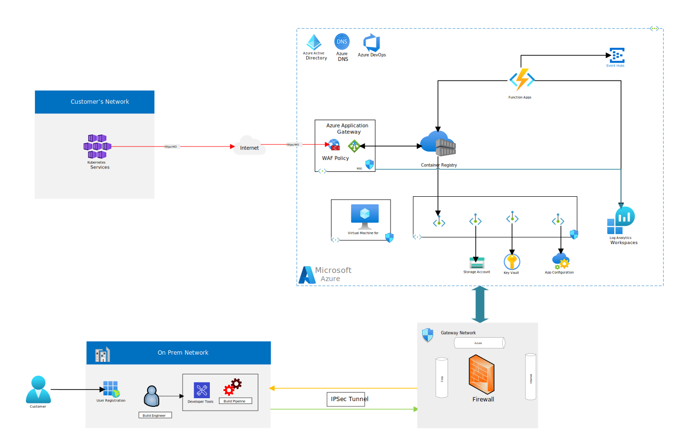

## Components

Many components and Azure services are used in the public facing ACR reference architecture. The components deployed as part of this architecture are listed below.
- **Azure Key Vault**: Key Vault is provisioned for storing sensitive values and keys used specifically for on-prem systems like build pipeline and user registration application to access ACR api and function App to publish data to on-prem applications.
- **Azure App Gateway**: Azure App Gateway with WAF v2 is used to load balance and route traffic to Azure Container registry and provide Layer 7 connectivity to authenticate/authorize customer applications and download container images. 
- **Container registry**: The container images for the workload are stored in a managed container registry. In this architecture, a single Azure Container Registry is used for all Kubernetes instances in the cluster. Geo-replication for Azure Container Registry enables replicating images to the selected Azure regions and providing continued access to images even if a region is experiencing an outage.
- **Log Analytics**: Regional Log Analytics instances are used for storing regional networking metrics and diagnostic logs. Additionally, a shared Log Analytics instance is used to store metrics and diagnostic logs for the ACR instance.
- **Logging and threat detection**: Microsoft Defender for Cloud built-in threat detection capability for Container Registry provides another layer of security intelligence. It detects unusual and potentially harmful attempts to access or exploit your Container Registry resources. 
- **Azure Functions**: Serve as processing engine to manage life cycle management of container images in ACR. These functions also monitor and process specific logging and monitoring of security events and notify security and monitoring operations control via Azure Event Hub.
- **Kubernetes Cluster**: This is a consuming application cluster deployed by consumers of the hosted container images in Azure Container Registry.
- **On Premise Applications**: Host the applications and tools (DevOps) used by developer to create container images and publish it to Azure Container Registry.
- **Gateway Network**: Implemented to provide secure communication layer between on-prem applications and applications hosted in Azure.

## Azure Resources Configuration

When you deploy this architecture, ensure the following configurations are set properly to get the solution working.

### Azure Container Registry

#### Overview
The Azure Container Registry (ACR) will be deployed and set to private access so that all public access will flow through the Application Gateway.

#### Public access
To make the ACR secure and enable network access only via the App Gateway, the public access should be disabled on the ACR. The Public network access setting under Networking should be set to “Selected network” in case there is a need to access the ACR directly via specific VNets or “Disabled” if you do not want any public network access.

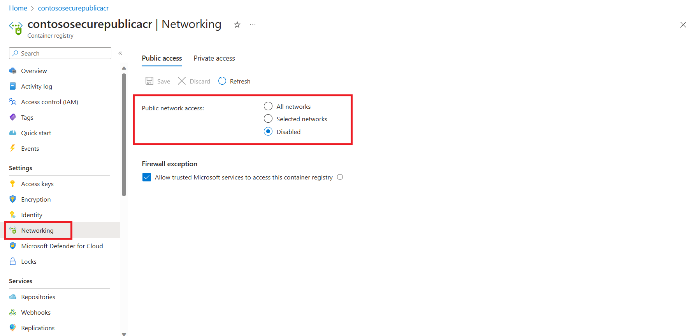

#### Private access
Ensure a private endpoint connection is created for the ACR and registered in a Private DNS zone so that it can be used by app gateway for connecting securely to the ACR.

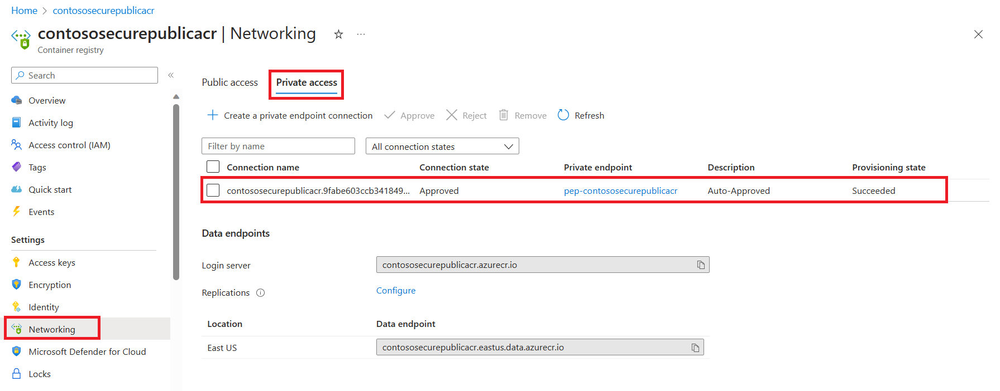
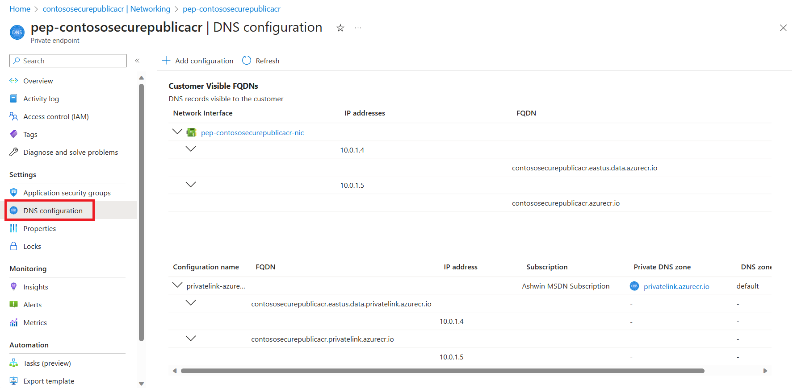

Take note of the private endpoints FQDN that are created i.e., *contososecurepublicacr.privatelink.azurecr.io* and *contososecurepublicacr.eastus.data.privatelink.azurecr.io* in this case. These FQDNs will be used while configuring the application gateway backend pool.

### Azure Application Gateway

#### Overview
The end users/applications will make requests to the app gateway which will then internally route them to Azure Container Registry.
To differentiate requests meant for the registry endpoint and data endpoint, two custom domains (e.g., *acr-secure.contoso.com* and *acr-secure-data.contoso.com*) will be set up to point to the same app gateway. The app gateway listeners will be configured to listen to both endpoints. Based on the listener, the requests will be privately routed over the VNet to the backend pool of the app gateway which has the ACR’s private endpoints configured.

ACR registry endpoint returns the authentication URL and the Data endpoint URL in the format *.azurecr.io as part of the REST endpoint response headers. However, to prevent end users from connecting directly to ACR, the application gateway’s “Rewrite headers” capability will be used to override the *.azurecr.io with *.contoso.com, ensuring that requests are routed through the custom domain and application gateway.

#### App Gateway Frontend IP Configuration
A public IP is needed for the app gateway that will act as front end for the incoming requests. The custom domains i.e. acr-secure.contoso.com and acr-secure-data.contoso.com in the example will point to this public address of the app gateway. Create a new public IP address or use an existing public IP in the same location as the application gateway.

#### App Gateway Backend pools
Application gateway needs to be configured to have two backend pools – Registry and Data.
The backend targets for these pools will point to the FQDN of the private links of ACR, such as *contososecurepublicacr.privatelink.azurecr.io* for the registry endpoint and *contososecurepublicacr.eastus.data.privatelink.azurecr.io* for the data endpoint.

Registry backend pool:

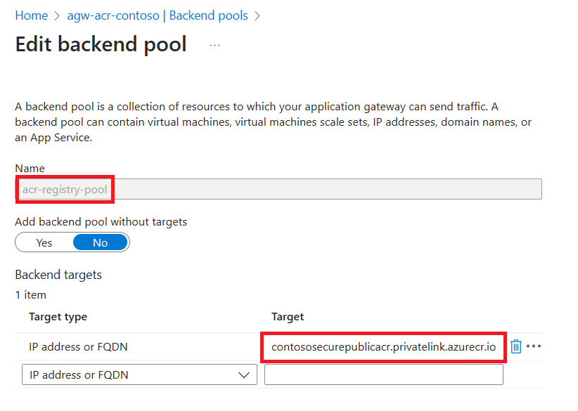

Data backend pool:

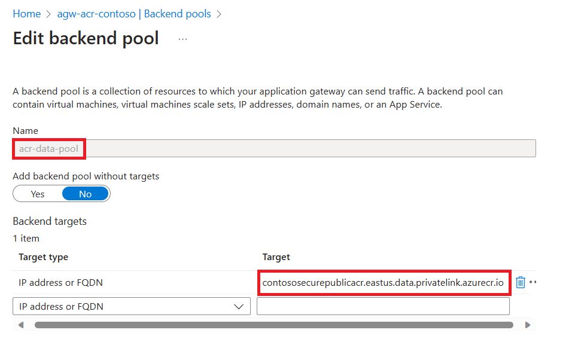

#### App Gateway Backend settings
Similarly, the backend settings need to be configured for both backend pools, ensuring that the backend protocol is set to HTTPS to achieve end-to-end TLS. Ensure you override the hostname with the hostname of the ACR so that the ACR certificate CN (Common Name) will match with the request. Also, custom health probes will be used which are covered in the next section.

Registry backend setting:

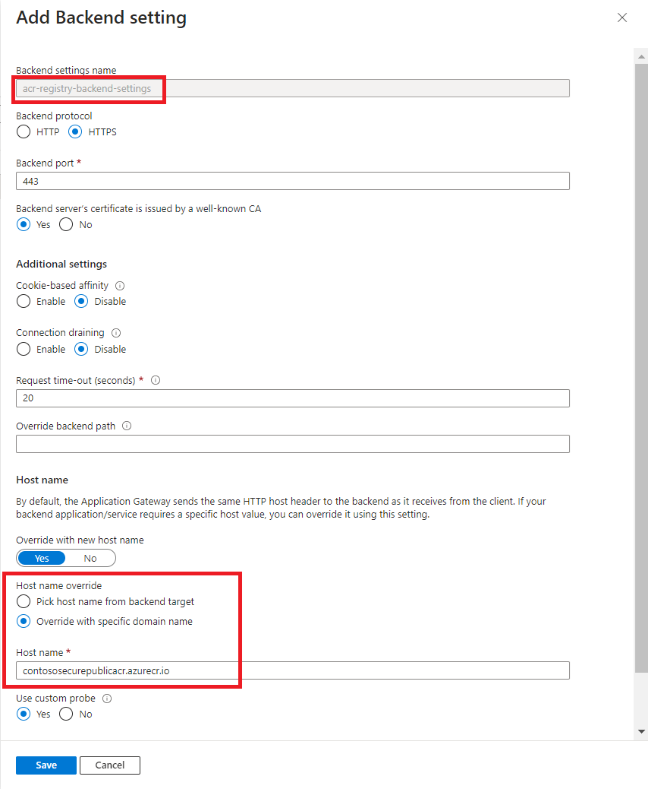

Data backend setting:

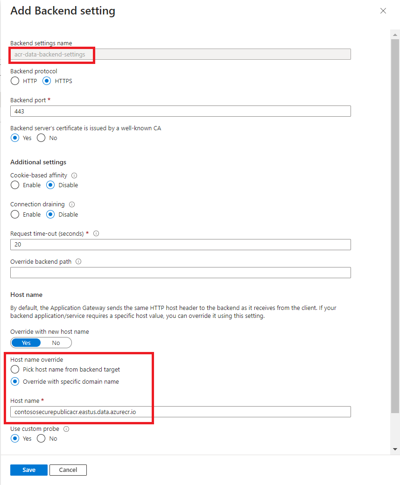

#### App Gateway Health probes
Custom health probes will be used to determine the health of backend pools. Please note the host, path and HTTP response status code match properties being set for the registry and data backend health probes. For the data endpoint, as the health probe cannot send the token, it would always result in a 403 error, but in this case, it indicates a healthy backend. For the registry endpoint the path is set to ‘/v2’ as ACR uses the v2 apis.

Registry backend health probe:

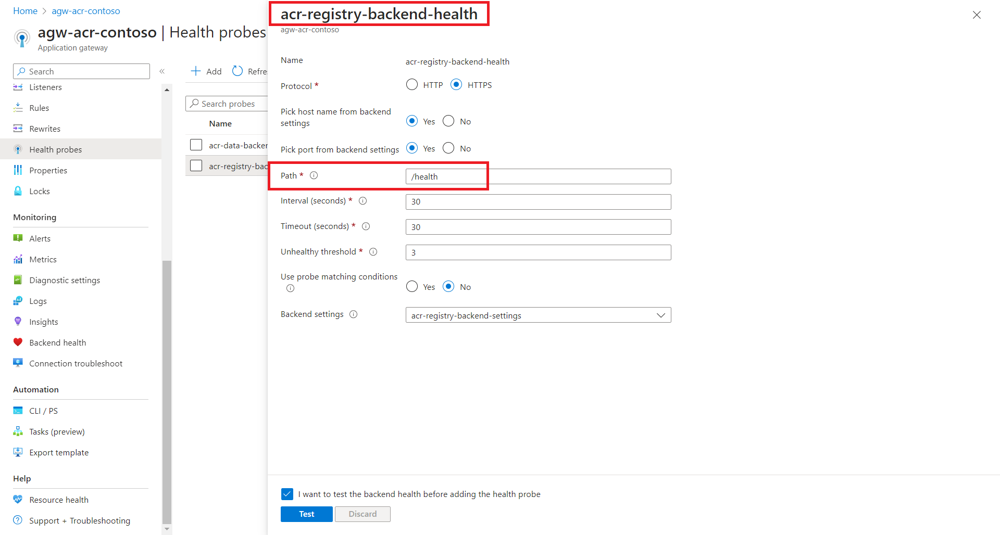

Data backend health probe:

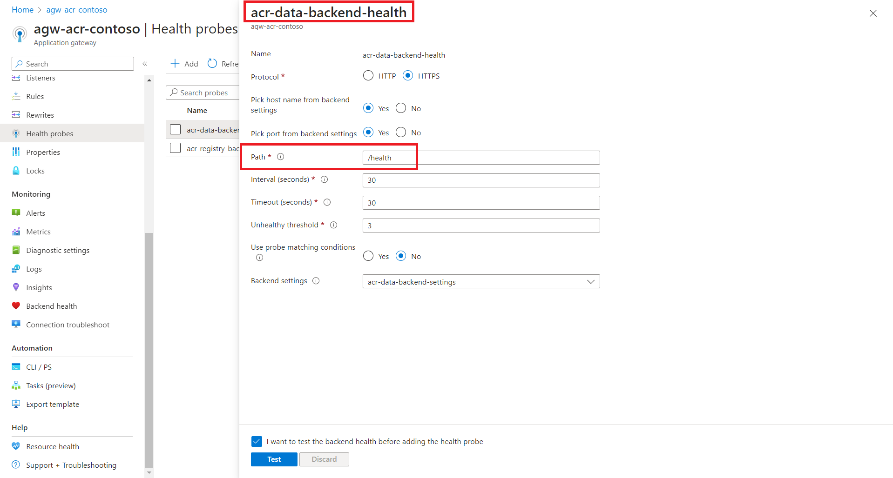

#### App Gateway Listeners
For the listeners in the app gateway, two HTTPS listeners need to be configured – Registry and Data. The listeners will be associated with custom hostnames such as *acr-secure.contoso.com* for the registry and *acr-secure-data.contoso.com* for the data endpoint (Use listener type Multi site to configure this). SSL certificates will need to be added while configuring these listeners, as they are HTTPS requests.

Registry listener:

Data listener:

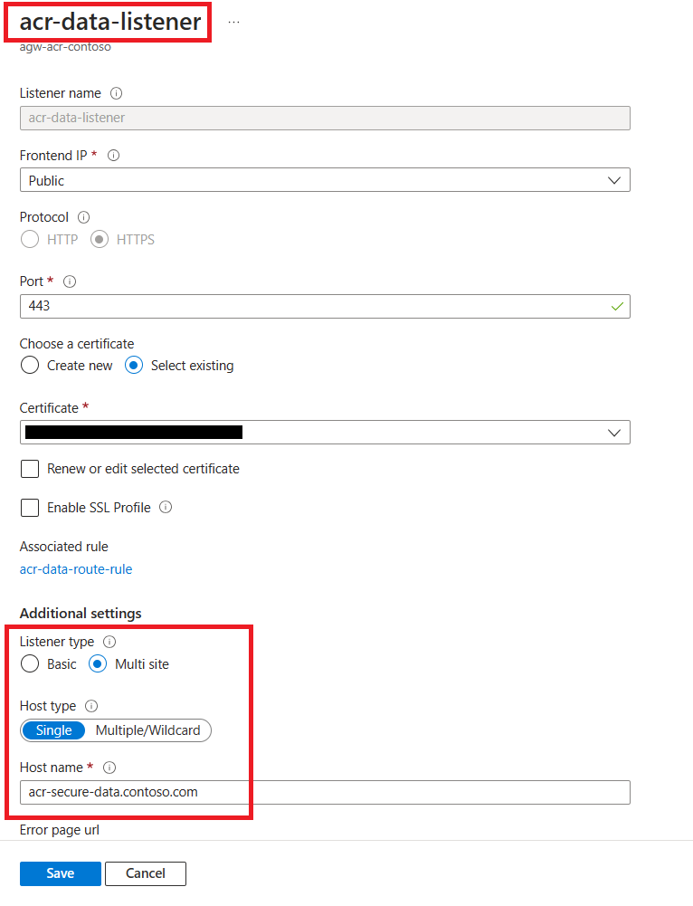

#### App Gateway Rules
Routing rules in the app gateway will be used to route requests from the listeners to the respective backend targets. Two routing rules will be required – one for the registry endpoint and one for the data endpoint, based on the listeners configured above. 

#### App Gateway Rewrites
Since ACR returns its own endpoints in various REST APIs, the application gateway’s rewrite headers capability will be used to overwrite the ACR endpoints with App gateway endpoints.

A rewrite set such as “acr-contoso-rewrite-set”, needs to be created, and the following rewrite rules should be added for the “registry routing rule” 
1. Rewrite Location Header
2. Rewrite WWW-Authenticate Header
3. Rewrite Data Location Header

No rewrite rules should be added for the “data routing rule”

The rewrite rules to be configured for the “registry routing rule” are as follows:
1. **Rewrite Location Header**
    
    This rule will rewrite the ‘Location’ header in HTTP response that matches acr to the registry/login endpoint of the app gateway when the status code is 302.
    
    - Add a condition to evaluate whether the location header in the response contains *contososecurepublicacr.azurecr.io*:

        a. Select **Add** condition and then select the box containing the **If** instructions to expand it.

        b.	In the **Type of variable** to check list, select **HTTP header**.

        c.	In the **Header type** list, select **Response Header**.

        d.	Select **Common header** under **Header name**.

        e.	In the **Common header** list, select **Location**.
        
        f.	Under **Case-sensitive**, select **No**.
        
        g.	In the **Operator** list, select **equal (=)**.
        
        h.	Enter a regular expression pattern. In this, we'll use the pattern `https:\/\/contososecurepublicacr.azurecr.io(.*)$`

        i.	Select **OK**
        
        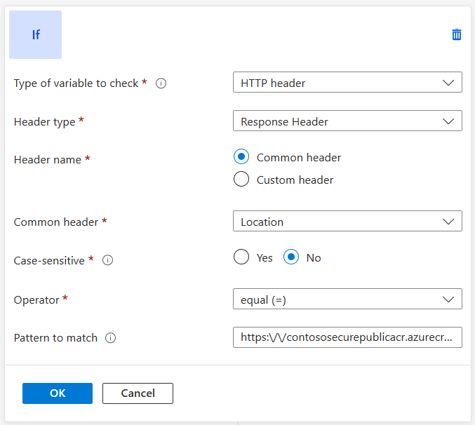

    - Add an action to rewrite the location header:
    
        a.	In the **Rewrite type** list, select **Response Header**.
        
        b.	In the **Action type** list, select **Set**.

        c.	Under **Header name**, select **Common header**.
        
        d.	In the **Common header** list, select **Location**.
        
        e.	Enter the header value. In this, we will use `https://acr-secure.contoso.com{http_resp_Location_1}` as the header value. This will replace *contososecurepublicacr.azurecr.io* with *acr-secure.contoso.com* in the location header.
        
        f.	Select **OK**.

        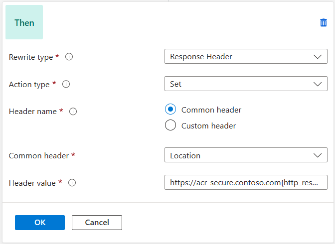

2. **Rewrite WWW-Authenticate Header**
    
    This rule will rewrite the ‘WWW-Authenticate’ header in the HTTP response that matches acr to the registry/login endpoint of the app gateway when the status code is 401.

    - Add a condition to evaluate whether the WWW-Authenticate header in the response contains *contososecurepublicacr.azurecr.io/oauth2/token*:

        a.	Select **Add** condition and then select the box containing the **If** instructions to expand it.
        
        b.	In the **Type of variable** to check list, select **HTTP header**.
        
        c.	In the **Header type** list, select **Response**.
        
        d.	In the **Header name** select **Common header**.
        
        e.	In the **Common header** list, select **WWW-Authenticate**.
        
        f.	Under **Case-sensitive**, select **No**.
        
        g.	In the **Operator** list, select **equal (=)**.
        
        h.	Enter a regular expression pattern. In this, we'll use the pattern `^(.*)https:\/\/contososecurepublicacr.azurecr.io\/oauth2\/token(.*)$`
        
        i.	Select **OK**
        
        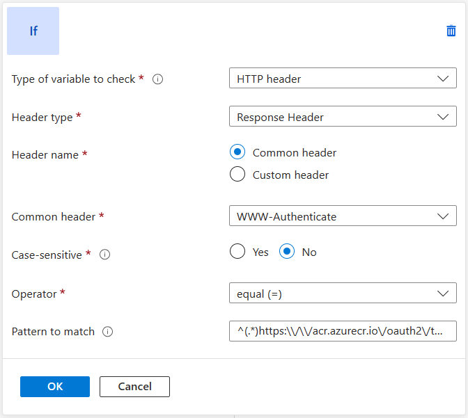

    - Add an action to rewrite the location header:
    
        a.	In the **Rewrite type** list, select **Response Header**.
        
        b.	In the **Action type** list, select **Set**.
        
        c.	Under **Header name**, select **Common header**.
        
        d.	In the **Common header** list, select **WWW-Authenticate**.
        
        e.	Enter the header value. In this, we'll use `{http_resp_WWW-Authenticate_1}https://acr-secure.contoso.com/oauth2/token{http_resp_WWW-Authenticate_2}` as the header value. This will replace *contososecurepublicacr.azurecr.io* with *acr-secure.contoso.com* in the WWW-Authenticate header.
        
        f.	Select **OK**.
        
        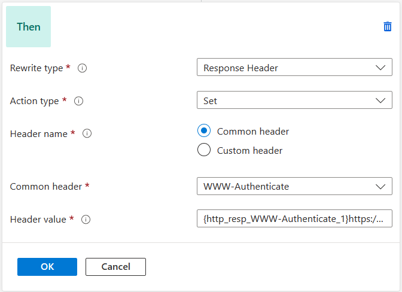

3. **Rewrite Data Location Header**

    This rule rewrites the ‘Location’ header in the HTTP Response that matches acr data to the data endpoint of the app gateway when the status code is 302.

    - Add a condition to evaluate whether the location header in the response contains *contososecurepublicacr.eastus.data.azurecr.io*:
    
        a.	Select **Add** condition and then select the box containing the **If** instructions to expand it.
    
        b.	In the **Type of variable** to check list, select **HTTP header**.
        
        c.	In the **Header type** list, select **Response Header**.
        
        d.	Select **Common header** under **Header name**.
        
        e.	In the **Common header** list, select **Location**.
        
        f.	Under **Case-sensitive**, select **No**.
        
        g.	In the **Operator** list, select **equal (=)**.
        
        h.	Enter a regular expression pattern. In this, we'll use the pattern `https:\/\/contososecurepublicacr.eastus.data.azurecr.io(.*)$`
        
        i.	Select **OK**
        
        

    - Add an action to rewrite the location header:
    
        a.	In the Rewrite type list, select Response Header.
        
        b.	In the Action type list, select Set.
        
        c.	Under Header name, select Common header.
        
        d.	In the Common header list, select Location.
        
        e.	Enter the header value. In this, we will use `https://acr-secure-data.contoso.com{http_resp_Location_1}` as the header value. This will replace contososecurepublicacr.eastus.data.azurecr.io with acr-secure-data.contoso.com in the location header.
        
        f.	Select **OK**.
        
        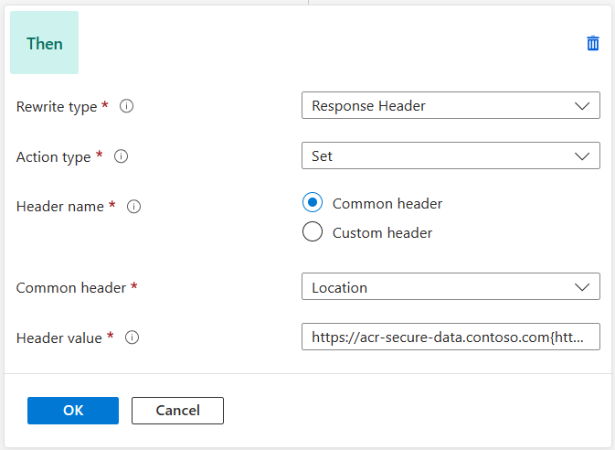

### Azure Web Application Firewall (WAF)
#### Overview
Azure Web Application Firewall (WAF) on Azure Application Gateway provides the ability to Geo-filter traffic, allowing or blocking certain countries/regions from accessing applications. This feature can be used to restrict access to the embargoed countries or IPs that are determined by the customer teams.

To configure WAF v2, create or attach the WAF from the Web Application Firewall section of app gateway.

In the Application Gateway WAF policy, custom rules can be implemented to block users based on their geo-location or IP address.

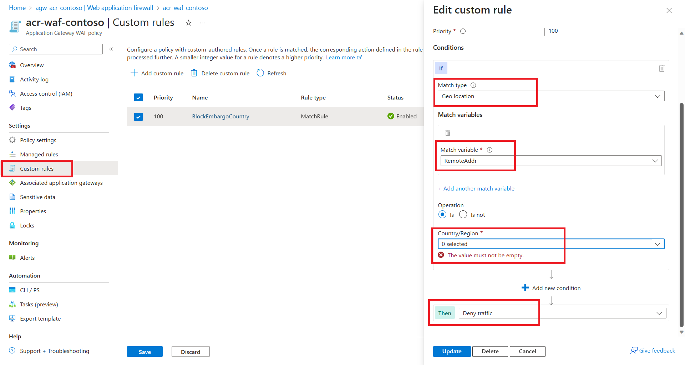

Ensure post testing, WAF is set to Prevention mode to block access matching the rules.

## Contributors

*This article is maintained by Microsoft. It was originally written by the following contributors.*

Principal authors:
- [Kumar Ashwin Hubert](https://www.linkedin.com/in/kumar-ashwin-hubert) | Consultant
- [Rajesh Singh](https://www.linkedin.com/in/rajeshsinghms) | Solution Architect

*To see non-public LinkedIn profiles, sign in to LinkedIn.*

## Next Steps
This reference architecture depicts the integration of Azure Container Registry (ACR) and Azure Application Gateway in conjunction with WAF policy to allow public access to the container images while keeping the ACR private and providing granularized access control using the ACR’s token and scope map feature. This architecture can be further extended to using geo-replication enabled ACR for multiple regions, by deploying an app gateway instance in each geo-replicated region and setting up a performance-based traffic manager with the multiple app gateway endpoints.

## Related resources
- [Azure Container Registries Overview](/azure/container-registry/container-registry-intro)
- [ACR Authenticate with token](/azure/container-registry/container-registry-repository-scoped-permissions)
- [Azure Application Gateway Overview](/azure/application-gateway/overview)
- [Rewrite HTTP request and response headers with Azure Application Gateway](/azure/application-gateway/rewrite-http-headers-portal)
- [Azure Web Application Firewall (WAF) - Geomatch custom rules](/azure/web-application-firewall/ag/geomatch-custom-rules)
